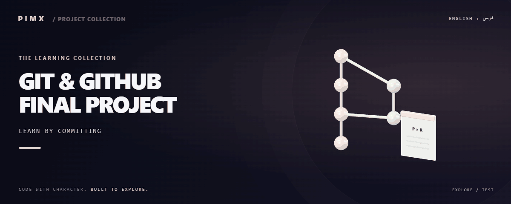

<div align="center">



**[English](README.md) · [فارسی](README.fa.md)**


</div>

# GIT & GITHUB FINAL PROJECT

A course assignment repository with a shell simple-interest calculator and contribution/community files.

[GitHub](https://github.com/MOHAMMADREZAABEDINPOOR/test) · [PIMX / Profile](https://github.com/MOHAMMADREZAABEDINPOOR) · [Static artwork](assets/readme/hero.png)

## Features

- Shell simple-interest calculator
- Contribution guidance
- Community code of conduct

## Stack

| Tool | Version / source |
|---|---|
| Bash | `shell script` |

## Getting started

Bash; use Git Bash or WSL on Windows.

```bash
git clone https://github.com/MOHAMMADREZAABEDINPOOR/test.git
cd test

bash simple-interest.sh 1000 5 2
```

## Configuration

No standard environment template is defined. Standalone exercises need no external configuration; inspect any service constants or paths in the source before running.

## Usage

Install Bash and bc, then run `bash simple-interest.sh 1000 5 2`: principal 1000, annual rate 5 percent, time 2 years. The result is 100.00.

## Project structure

| Path | Role |
|---|---|
| [`assets/`](assets/) | Brand/media/README assets |
| [`simple-interest.sh`](simple-interest.sh) | Project entry/configuration file |

## Commands and checks

No automated test command is declared in a manifest. Verify behavior through a local example run.

## Deployment

This is a local learning exercise, not a public service. Browser exercises can use static hosting.

## Limitations

This is an educational calculator. Read its rate/unit handling; it is not financial advice.

## Troubleshooting

- Bash unavailable on Windows: use Git Bash or WSL.
- Calculation failure: check required arguments, numeric inputs and the bc/expr utility used by the script.

## Contributing

Create a focused branch, verify the affected behavior and explain the change clearly. Keep private data, build outputs and local databases out of commits.

Supporting guides:

- [CONTRIBUTING.md](CONTRIBUTING.md)

## License

The repository license text is in the following file; third-party resources and dependencies can have different terms: [LICENSE](LICENSE).

---

Part of **PIMX** · Documentation in English and Persian.
